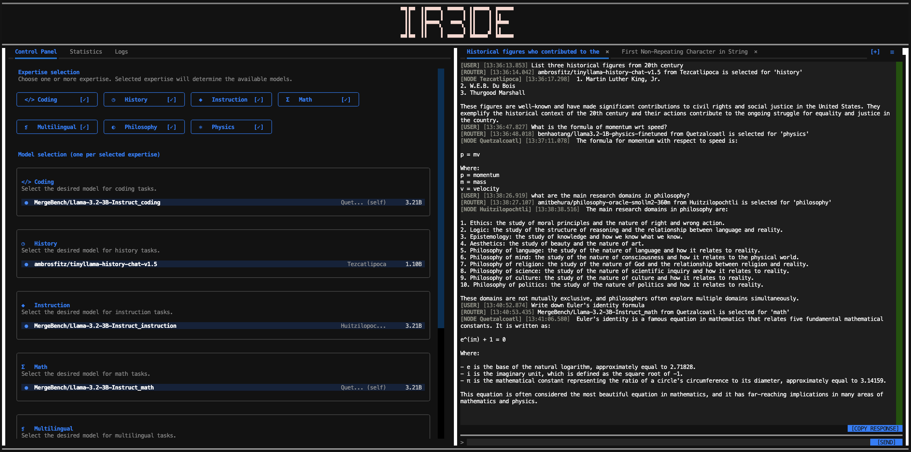

# IR3DE-AXL

[](https://arxiv.org/pdf/2606.06098)
[](https://www.python.org/downloads/release/python-3100/)
[](LICENSE)



This repository implements a decentralized, multi-agent chat system: every peer is a node on [Gensyn's AXL](https://github.com/gensyn-ai/axl) P2P network, each hosting one or more domain-expert LLMs (coding, math, physics, ...), using **IR3DE** to decide, for every message across the whole network, which expert is best suited to answer it.

[IR3DE](https://arxiv.org/pdf/2606.06098) is a lightweight inference router that automatically selects the best domain expert for any given prompt. Rather than training a model to pick an expert, each expert is represented by a small ridge-regression fit (an `A`/`b` matrix pair) over its domain's own token embeddings. To route a message, its tokens are embedded, scored against every candidate tag's regression, filtered by entropy (uncertain tokens are dropped), and the remaining tokens "vote" for the tag whose expert should answer. Adding or removing an expert just means adding or removing its regression stats — never retraining the router itself. See the [paper](https://arxiv.org/pdf/2606.06098), the [official IR3DE code](https://github.com/gensyn-ai/IR3DE), and the [blog post](https://blog.gensyn.ai/look-beyond-one-size-fits-all-llms-with-ir3de/) for the full research behind the router.

**This repository is built directly on top of that work**, adding the AXL P2P transport layer, a Textual-based multi-chat TUI, and the lazy-loading expert-serving infrastructure needed to run a live network of these experts, rather than an offline benchmark.

## Installation

**Prerequisites:**
- **Go 1.25.5+** — needed to build the AXL node binary. The build pins `GOTOOLCHAIN=go1.25.5`, so any reasonably recent Go install works — it fetches the exact toolchain version itself. Get it from [go.dev/dl](https://go.dev/dl/).
- **OpenSSL with Ed25519 support** — used to generate each node's private key. macOS ships LibreSSL by default, which does *not* support Ed25519. Install real OpenSSL first (`brew install openssl`).

1) Download and build axl within this repository:

```
git clone https://github.com/gensyn-ai/axl.git
cd axl
go build -o node ./cmd/node/
cd ..
```

2) Set up one or more local nodes. Either generate custom ones:

```
./scripts/add_local_node.sh [NUM-PEERS]
```

or use one of the four ready-made setups in [Examples](#examples) below.

3) Install the Python dependencies (pick one):

### Option A: conda

```
conda env create -f requirements.yml
conda activate ir3deaxl
```

### Option B: venv

Requires Python 3.10 available on your PATH as `python3.10` (install it via your OS package manager, [python.org](https://www.python.org/downloads/), or `pyenv` if it isn't already) — the pinned package versions below were resolved and tested against it, and some of them ship platform-specific binary wheels that aren't guaranteed to exist for other Python versions.

```
python3.10 -m venv .venv
source .venv/bin/activate        # Windows: .venv\Scripts\activate
pip install --upgrade pip
pip install -r requirements.txt
```

Both options install the exact same, verified set of package versions (`requirements.txt` is the single source of truth — `requirements.yml`'s pip section just references it).

**GPU note:** After installing, verify GPU acceleration is actually being used:

```
python -c "import torch; print(torch.cuda.is_available())"
```

If that prints `False` on a machine that does have a GPU, reinstall `torch` following the selector at [pytorch.org/get-started/locally](https://pytorch.org/get-started/locally/) for your CUDA version before reinstalling the rest of `requirements.txt`.

4) Run the simulation:

```
python run.py [--peer-id PEER_ID] [--tok-type {mistral,llama}]
```

`--peer-id` is only needed when running more than one simulated local peer at once (see step 2); omit it to run the single default local peer.

`--tok-type` selects which tokenizer/embedder identity this peer uses for IR3DE routing (`mistral` or `llama`; default `mistral`). The IR3DE stats themselves (from [`Erosinho/IR3DE-stats`](https://huggingface.co/Erosinho/IR3DE-stats)) are public for both. The ready-made examples in this repo use the default and do not need a Hugging Face token. However, selecting `--tok-type llama` needs a Hugging Face token because routing then loads the tokenizer and embedding layer of [`meta-llama/Meta-Llama-3-8B`](https://huggingface.co/meta-llama/Meta-Llama-3-8B), which is gated (`hf auth login`, after requesting access on that model page).

## Examples

Several ready-made setups live in `local_nodes/`, each with its own `setup.sh` and README:

[Local 2-node example](local_nodes/example_1/README.md) shows how to setup two nodes with disjoint experts covering 7 domains between them. This example can be run in a single local device.

[Remote 3-node example](local_nodes/example_4/README.md) shows how to run across three separate physical machines, each hosting some domain experts. It requires real, reachable IP addresses between the nodes. 

You can also find examples on [different network topologies](local_nodes/example_2/README.md) and how to [setup and serve different IR3DE stats](local_nodes/example_3/README.md).

Each example's `setup.sh` installs its config/metadata into `local_nodes/`; see each README for exact usage and resource requirements, then run each node with `python run.py [--peer-id NN]` as instructed there.

