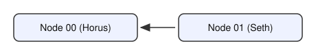

# Example 1

Two local peers that together serve seven experts.

## Nodes

**Node 00 — "Horus"** (`local_nodes/config00.json`/`metadata00.json`)
Hosts four [MergeBench](https://huggingface.co/MergeBench) Llama-3.2-3B experts:

| Tag         | Model |
|-------------|-------|
| coding      | `MergeBench/Llama-3.2-3B_coding` |
| math        | `MergeBench/Llama-3.2-3B_math` |
| multilingual | `MergeBench/Llama-3.2-3B_multilingual` |
| instruction | `MergeBench/Llama-3.2-3B_instruction` |

The default configuration uses the ungated tokenizer hosted at `unsloth/Llama-3.2-3B`. To use the official tokenizer from the gated `meta-llama/Llama-3.2-3B` repository instead:
1. Request access at [huggingface.co/meta-llama/Llama-3.2-3B](https://huggingface.co/meta-llama/Llama-3.2-3B) and wait for approval.
2. Log in locally with a token that has that access: `huggingface-cli login` (or set the `HF_TOKEN` environment variable).
3. Before running `setup.sh`, edit this directory's `metadata00.json` and change every `"tokenizer": "unsloth/Llama-3.2-3B"` to `"tokenizer": "meta-llama/Llama-3.2-3B"`.

**Node 01 — "Seth"** (`local_nodes/config01.json`/`metadata01.json`)
Hosts three small, standalone domain-expert models:

| Tag        | Model |
|------------|-------|
| physics    | `benhaotang/llama3.2-1B-physics-finetuned` |
| history    | `ambrosfitz/tinyllama-history-chat-v1.5` |
| philosophy | `amitbehura/philosophy-oracle-smollm2-360m` |

## Visibility



Node 01's config lists Node 00 as a peer (`"Peers": ["tls://127.0.0.1:9000"]`);
Node 00's config lists none. Once Node 01's periodic greeting reaches Node 00,
Node 00 registers it and replies immediately, and from that point on both
nodes can route messages to each other normally.

## Resource requirements

Models are downloaded and loaded lazily, one at a time, on first use, and the
least-recently-used one is evicted from memory if memory runs low.

| Node | Disk (all models used) | RAM: 1 model resident | RAM: all models resident |
|------|------------------------|------------------------|---------------------------|
| Node 00 (Horus) | ~24 GB | ~9 GB | ~31 GB |
| Node 01 (Seth)  | ~7.3 GB | ~5 GB | ~8 GB |

Given that in this example both nodes run on the same machine, the requirements adds together. A CUDA GPU is used automatically if available, applying the same limits to VRAM instead of RAM.

## Run it

From the repo root, with dependencies already installed (see the main
[README](../../README.md)) and `axl/node` already built:

```
./local_nodes/example_1/setup.sh
```

This backs up whatever's currently in `local_nodes/` (into a fresh
`local_nodes/<timestamp>-bkp/` directory — nothing is deleted), copies this
example's config/metadata files into `local_nodes/`, and generates a new
ed25519 private key for each node. Then, in two separate terminals from the
repo root:

```
python run.py --peer-id 00
```
```
python run.py --peer-id 01
```
