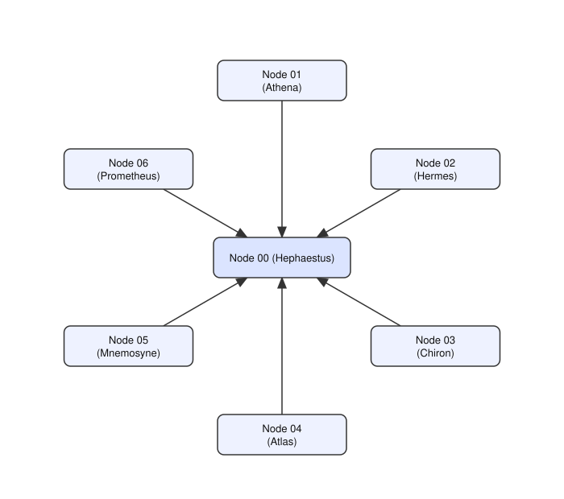

# Example 2

The same seven IR3DE expertise models used in [example_1](../example_1/README.md), but each one now lives on its own node. Seven nodes total, connected in a star topology with Node 00 at the center.

## Nodes

| Node | Name | Tag | Model |
|------|------|-----|-------|
| 00 | Hephaestus | coding | `MergeBench/Llama-3.2-3B_coding` |
| 01 | Athena | math | `MergeBench/Llama-3.2-3B_math` |
| 02 | Hermes | multilingual | `MergeBench/Llama-3.2-3B_multilingual` |
| 03 | Chiron | instruction | `MergeBench/Llama-3.2-3B_instruction` |
| 04 | Atlas | physics | `benhaotang/llama3.2-1B-physics-finetuned` |
| 05 | Mnemosyne | history | `ambrosfitz/tinyllama-history-chat-v1.5` |
| 06 | Prometheus | philosophy | `amitbehura/philosophy-oracle-smollm2-360m` |

These are the exact same models discussed in
[example_1's Nodes section](../example_1/README.md#nodes). To use the gated original `meta-llama/Llama-3.2-3B` tokenizer, follow the instructions in `example_1`, editing `metadataNN.json` for nodes 00–03.

## Topology



Node 00's config lists no peers; each of Nodes 01–06 lists Node 00 as its
only peer (`"Peers": ["tls://127.0.0.1:9000"]`). Once a leaf's periodic greeting reaches Node 00,
Node 00 registers it and can route messages back to it directly.

## Resource requirements

Each node loads only its own single model.

| Node | # params | Disk | RAM |
|------|----------|------|-----|
| Node 00 (Hephaestus) | ~3.2B | ~6.0 GB | ~7.2 GB |
| Node 01 (Athena) | ~3.2B | ~6.0 GB | ~7.2 GB |
| Node 02 (Hermes) | ~3.2B | ~6.0 GB | ~7.2 GB |
| Node 03 (Chiron) | ~3.2B | ~6.0 GB | ~7.2 GB |
| Node 04 (Atlas) | 1.2B | ~4.6 GB | ~2.8 GB |
| Node 05 (Mnemosyne) | 1.1B | ~2.0 GB | ~2.5 GB |
| Node 06 (Prometheus) | 0.36B | ~0.7 GB | ~0.8 GB |

Running all seven on the same machine at once, as this example does, adds
up to roughly 31 GB of disk and 35 GB of RAM.

## Run it

From the repo root, with dependencies already installed (see the main
[README](../../README.md)) and `axl/node` already built:

```
./local_nodes/example_2/setup.sh
```

This backs up whatever's currently in `local_nodes/` (into a fresh
`local_nodes/<timestamp>-bkp/` directory — nothing is deleted), copies this
example's config/metadata files into `local_nodes/`, and generates a new
ed25519 private key for each node. Then, in seven separate terminals from
the repo root:

```
python run.py --peer-id 00
```
```
python run.py --peer-id 01
```
```
python run.py --peer-id 02
```
```
python run.py --peer-id 03
```
```
python run.py --peer-id 04
```
```
python run.py --peer-id 05
```
```
python run.py --peer-id 06
```
