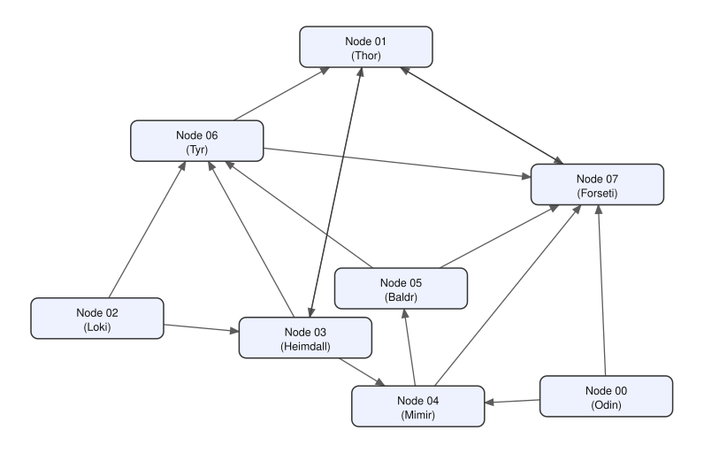

# Example 3

Eight local nodes connected in a randomly generated directed graph. Each node serves a different random mix of 0–3 expert models. All nodes have no default IR3DE stats, but each serves 0–2 of them.

## Nodes

| Node | Name | Experts | Stats |
|------|------|---------|-------|
| 00 | Odin | coding | coding (humaneval) |
| 01 | Thor | physics | physics (m2d2_physics_l1), math (gsm8k) |
| 02 | Loki | — | — |
| 03 | Heimdall | multilingual, instruction | multilingual (m_arc), instruction (ifeval) |
| 04 | Mimir | history | history (m2d2_History_and_events) |
| 05 | Baldr | philosophy | — |
| 06 | Tyr | math, instruction, physics | coding (m2d2_cs_l1) |
| 07 | Forseti | — | math (m2d2_math_l1), philosophy (m2d2_Philosophy_and_thinking) |

The coding/math/multilingual/instruction and physics/history/philosophy models are the same ones (and the same generation-tokenizer choices) discussed in [example_1](../example_1/README.md#nodes). Heimdall's second model, `MergeBench/gemma-2-2b_instruction`, is a different, ungated `MergeBench` family with its own bundled tokenizer — used alongside Tyr's Llama-based instruction model to show that different nodes can serve the same tag with different underlying models.

## Topology



16 directed edges total across 8 nodes (2 per node on average, ranging from 1 to 3), and the graph is a single connected component — every node is reachable from every other node if you ignore edge direction.
The periodic greeting/gossip mechanism makes every node in a single connected component like this one eventually be able to message every other node directly.

## IR3DE stats

The stats in the table above come from the
[`Erosinho/IR3DE-stats`](https://huggingface.co/Erosinho/IR3DE-stats) repo, downloaded automatically the first time each is used. This example uses IR3DE stats extracted with the `Mistral-7B-v0.1` tokenizer and embedding layer — the same identity as the default `--tok-type mistral`.
Normally every node also automatically serves everything listed in `ir3de_stats/default_stats.json` on top of its own `metadata.json` (see `Peer.__init__` in `src/peer.py`). This example wants each node to serve *only* the specific stats listed for it above, so every node here is run with `--default-stats` pointed at `no_default_stats.json`, which lists no stats at all (`{"stats": []}`):

```
python run.py --peer-id NN --default-stats local_nodes/example_3/no_default_stats.json
```

## Resource requirements

Models are downloaded and loaded lazily, one at a time, on first use, and the
least-recently-used one is evicted from memory if memory runs low.

| Node | Name | Disk (all models used) | RAM: 1 model resident | RAM: all models resident |
|------|------|-------------------------|------------------------|---------------------------|
| 00 | Odin | ~6.0 GB | ~7.2 GB | ~7.2 GB |
| 01 | Thor | ~4.6 GB | ~2.8 GB | ~2.8 GB |
| 02 | Loki | — | — | — |
| 03 | Heimdall | ~10.9 GB | ~7.2 GB | ~13.0 GB |
| 04 | Mimir | ~2.0 GB | ~2.5 GB | ~2.5 GB |
| 05 | Baldr | ~0.7 GB | ~0.8 GB | ~0.8 GB |
| 06 | Tyr | ~16.6 GB | ~7.2 GB | ~17.1 GB |
| 07 | Forseti | — | — | — |

Given that in this example all eight nodes run on the same machine, running
them together adds these up — though Thor and Tyr share the same physics
model, so combined RAM in practice will be a bit less than the sum. IR3DE
stats add roughly 5 GB more disk (shared across nodes) and roughly 2 GB
more RAM per node using stats (00, 01, 03, 04, 06, 07), for the Mistral
tokenizer/embedder they need.

## Run it

From the repo root, with dependencies already installed (see the main
[README](../../README.md)) and `axl/node` already built:

```
./local_nodes/example_3/setup.sh
```

This backs up whatever's currently in `local_nodes/` (into a fresh
`local_nodes/<timestamp>-bkp/` directory — nothing is deleted), copies this
example's config/metadata files into `local_nodes/`, and generates a new
ed25519 private key for each node. Then, in eight separate terminals from
the repo root:

```
python run.py --peer-id 00 --default-stats local_nodes/example_3/no_default_stats.json
```
```
python run.py --peer-id 01 --default-stats local_nodes/example_3/no_default_stats.json
```
```
python run.py --peer-id 02 --default-stats local_nodes/example_3/no_default_stats.json
```
```
python run.py --peer-id 03 --default-stats local_nodes/example_3/no_default_stats.json
```
```
python run.py --peer-id 04 --default-stats local_nodes/example_3/no_default_stats.json
```
```
python run.py --peer-id 05 --default-stats local_nodes/example_3/no_default_stats.json
```
```
python run.py --peer-id 06 --default-stats local_nodes/example_3/no_default_stats.json
```
```
python run.py --peer-id 07 --default-stats local_nodes/example_3/no_default_stats.json
```

## Extracting IR3DE stats (optional)

Every IR3DE stats file this repo uses is already computed and published on Hugging Face ([`Erosinho/IR3DE-stats`](https://huggingface.co/Erosinho/IR3DE-stats)), and `peer.py` downloads whichever ones it needs automatically at runtime. Therefore, **you do not need to run anything in this section to use this repo.**

`src/extract_ir3de_stats.py` is kept as a worked example of how those stats were produced, in case you want to add IR3DE support for a new dataset, tokenizer, or embedding layer. The reasoning-benchmark datasets (`gsm8k`, `m_arc`, `humaneval`, `ifeval`) are downloaded automatically via `lm-eval-harness`; the CLM/M2D2 domain datasets (`cs_l1`, `math_l1`, `physics_l1`, `History_and_events`, `Philosophy_and_thinking`) need to be downloaded and prepared by hand first, following the instructions in
[gensyn-ai/dume's dataset README](https://github.com/gensyn-ai/dume/blob/main/dataset/README.md).

```
python src/extract_ir3de_stats.py --dataset DATASET [--tok-type {mistral,llama}] [options]
```
