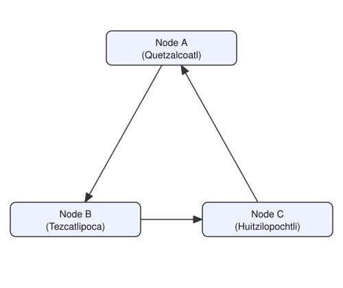

# Example 4

Unlike examples 1–3, this one runs on **three separate physical machines**,
each with its own clone of this repository, connected in a cycle. Each machine runs a single local node (no `--peer-id`), so only one `config.json` and one `metadata.json` are needed per machine.

## Nodes

| Node | Name | Experts |
|------|------|---------|
| A | Quetzalcoatl | coding, math, physics |
| B | Tezcatlipoca | multilingual, history |
| C | Huitzilopochtli | instruction, philosophy |

The models are the same seven discussed in [example_1](../example_1/README.md#nodes).

## Remote setup

Each of the three machines needs its own working copy of this repo, with
dependencies installed and `axl/node` built on that machine.

Since the three nodes are on different machines, `local_nodes/config.json`
can't use `127.0.0.1` for peers the way the local-simulation examples do —
each node needs the *real, reachable* IP address of the next node in the
cycle (a LAN IP, VPN IP, or public IP with the right port forwarded/open).
This example's `config.json` is a single template with a placeholder for
that address:

```json
{
  "PrivateKeyPath": "local_nodes/pk.pem",
  "Peers": ["tls://<NEXT_NODE_IP>:9000"],
  "Listen": ["tls://0.0.0.0:9000"],
  "api_port": 9100,
  "bridge_addr": "127.0.0.1"
}
```

After running `setup.sh` (below), edit `local_nodes/config.json` on **each** machine and replace `<NEXT_NODE_IP>` with the real IP of whichever machine is next after it in the cycle — on Quetzalcoatl's machine, that's Tezcatlipoca's IP; on Tezcatlipoca's, it's Huitzilopochtli's; on Huitzilopochtli's, it's Quetzalcoatl's. Make sure port 9000 is reachable between them (firewall/NAT permitting).

## Topology



Each node's config lists only the next node in the cycle, and once its periodic greeting reaches that node, the two can message each other directly.

## Resource requirements

Each machine only needs to fit its own node — nothing is shared across
machines here (unlike the local examples, where nodes on the same machine
share one disk cache).

| Node | Name | RAM | Disk |
|------|------|-----|------|
| A | Quetzalcoatl | ~17.2 GB | ~16.6 GB |
| B | Tezcatlipoca | ~9.7 GB | ~8.0 GB |
| C | Huitzilopochtli | ~8.0 GB | ~6.7 GB |

## Run it

On each of the three machines, from the repo root, with dependencies
installed and `axl/node` already built:

```
./local_nodes/example_4/setup.sh [NODE]
```

Substitute `[NODE]` with `A`, `B`, or `C` depending on which role that machine plays. This backs up whatever's currently in `local_nodes/config.json`,
`local_nodes/metadata.json`, and `local_nodes/pk.pem` (into a fresh
`local_nodes/<timestamp>-bkp/` directory — nothing is deleted), installs
this example's `config.json` and the role's `metadata.json`, and generates
a new ed25519 private key.

Then, on each machine, edit `local_nodes/config.json` as described in
Remote setup above, and run:

```
python run.py
```
